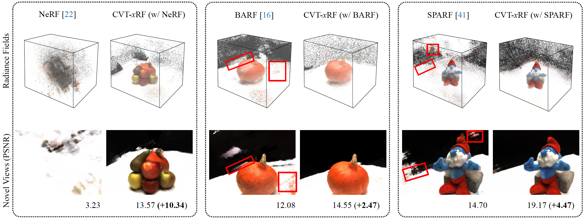

# CVT-xRF: Contrastive In-Voxel Transformer for 3D Consistent Radiance Fields from Sparse Inputs

<a href='https://arxiv.org/abs/2403.16885'></a> &nbsp; <a href='https://zhongyingji.github.io/CVT-xRF/'></a>  

This repository contains the code release for the CVPR 2024 project: 
> [**CVT-xRF: Contrastive In-Voxel Transformer for 3D Consistent Radiance Fields from Sparse Inputs**](https://arxiv.org/abs/2403.16885),  
> Yingji Zhong, Lanqing Hong, Zhenguo Li, and Dan Xu  
> Computer Vision and Pattern Recognition (CVPR), 2024
<br/>



Our approach CVT-xRF explicitly models 3D radiance field consistency for sparse-inputs NeRF, which comprises three components, (i) voxel-based ray sampling; (ii) local implicit constraint with in-voxel transformer; (iii) global explicit constraint with contrastive loss. The CVT module can be plugged into different baselines, e.g., vanilla NeRF, BARF and SPARF. 
<br/>

--------------------------------------

## Installation
It is recommended to use Anaconda to set up the environment. Create a new enviroment `cvtxrf` and activate it: 
```
conda create -n cvtxrf python=3.7
conda activate cvtxrf
```
Download the code and install the required packages: 
```
git clone https://github.com/zhongyingji/CVT-xRF.git
cd CVT-xRF/
pip install torch==1.11.0+cu113 torchvision==0.12.0+cu113 torchaudio==0.11.0 --extra-index-url https://download.pytorch.org/whl/cu113 # install pytorch with the correct CUDA version
pip install -r requirements.txt
```

--------------------------------------
## Datasets
Currently, we only support two datasets for training, DTU and Synthetic datasets. We first create a data root by `mkdir data/`. 

**DTU:** We use the DTU dataset provided by pixelNeRF. The images are processed and resized to 300x400. Download the dataset [here](https://drive.google.com/drive/folders/1PsT3uKwqHHD2bEEHkIXB99AlIjtmrEiR?usp=sharing). We also report masked metrics following [RegNeRF](https://github.com/google-research/google-research/tree/master/regnerf). Download the masks for test split [here](https://drive.google.com/file/d/1Yt5T3LJ9DZDiHbtd9PDFNHqJAd7wt-_E/view?usp=sharing). 

**Synthetic:** We use the Synthetic dataset (nerf_synthetic) used in the original NeRF paper. Download the dataset [here](https://drive.google.com/drive/folders/128yBriW1IG_3NJ5Rp7APSTZsJqdJdfc1). 

Place the downloaded datasets and masks in `data/`. The directory should be like: 
```
├── data                                                              
│   ├── rs_dtu_4                                                                                                  
│   │   └── DTU                                                                                                                             
│   │   └── proc.py                                                                
|   |   └── ...
|   ├── DTU_mask
|   |   └── idrmasks
|   ├── nerf_synthetic
|   |   └── lego
|   |   └── ship   
|   |   └── ...
```

--------------------------------------
## Running the code
The following instructions will guide you run our method on the baseline of BARF, which is CVT-xRF (w/ BARF) in the paper. For applying CVT module on SPARF, i.e., CVT-xRF (w/ SPARF), please refer to [this page](./cvtxrf-sparf/sparf/). 
### Training
* **Preprocess:** 
Below are templates for running the preprocessing step. Please replace `<input_views>` with the specific number of training views, and `<scene>` with the id/name of scenes ([Examples](./scripts/example_barf_preprocess.sh)). This step generally takes 5-10 minutes. 
  ```
  # DTU template
  python dataloader/dtu_loader.py --n_train_imgs <input_views> --scene <scene> --dtu_reader "sparf" 
  # <input_views>: {3, 6, 9}
  # <scene>: {8, 21, 30, 31, 34, 38, 40, 41, 45, 55, 63, 82, 103, 110, 114}

  # Synthetic template
  python dataloader/blender_loader.py --n_train_imgs <input_views> --scene <scene> 
  # <input_views>: {3, 8}
  # <scene>: {"lego", "hotdog", "chair", "drums", "ficus", "materials", "mic", "ship"}
  ```
  If the preprocessing step is finished correctly, there is a `vox_ray_storage/` as the following structure (take DTU 3-view scan40, and Blender 3-view "lego" as examples): 
  ```
  ├── vox_ray_storage                                                              
  │   ├── DTU_scan40_voxel_flag_300x400_64vox_range6_3images_sparfreader                                                                                                  
  │   │   └── 300x400_64vox_range6_3images_sparfreader_voxel_sum.npy                                                                                                                             
  │   │   └── 300x400_64vox_range6_3images_sparfreader_ray_0.npy                                                      
  |   |   └── ...
  |   ├── Blender_lego_voxel_flag_800x800_64vox_range6_3images
  |   |   └── 800x800_64vox_range6_3images_voxel_sum.npy
  |   |   └── 800x800_64vox_range6_3images_ray_0.npy   
  |   |   └── ...
  ```


  **NOTE:** The above step is necessary for each scene before training. 

* **Train:** 
Once you have completed the preprocessing step, you can train the model using the provided script. Make sure to replace `<input_views>` and `<scene>` in the script with the actual values you used when running the preprocessing script ([Examples](./scripts/example_barf_train.sh)). 
  ```
  # DTU template
  python run_nerf.py --config configs/barf/dtu/<input_views>v.txt \
  --expname dtu_scan<scene>_n<input_views>_barf \
  --datadir ./data/rs_dtu_4/DTU/scan<scene> \
  --dtu_maskdir ./data/DTU_mask/idrmasks/scan<scene>

  # Synthetic template
  python run_nerf.py --config configs/barf/blender/<input_views>v.txt \
  --expname blender_<scene>_n<input_views>_barf \
  --datadir ./data/nerf_synthetic/<scene> 
  ```
  The training lasts no more than 3 hours on a 3090Ti GPU. The above scripts also evaluate on test split, and render videos at the end of the training. 

### Evaluation
**Test or render videos of a trained model:** Once the training process is complete, you can test or render videos using the same script that was used for training. Simply append either `--test_only` or `--render_only` to the script, depending on your desired operation ([Examples](./scripts/example_barf_eval.sh)).

--------------------------------------
## Citation
If you find our project helpful, please cite it as: 
```
@inproceedings{zhong2024cvt,
  title={CVT-xRF: Contrastive In-Voxel Transformer for 3D Consistent Radiance Fields from Sparse Inputs},
  author={Zhong, Yingji and Hong, Lanqing and Li, Zhenguo and Xu, Dan},
  booktitle={Proceedings of the IEEE/CVF Conference on Computer Vision and Pattern Recognition},
  year={2024}
}
```

--------------------------------------
## Acknowledgements
This code is mainly based on [nerf-pytorch](https://github.com/yenchenlin/nerf-pytorch). It also integrates code snippets from [DIVeR](https://github.com/lwwu2/diver) and [SPARF](https://github.com/google-research/sparf). We thank the authors for their great works. 
